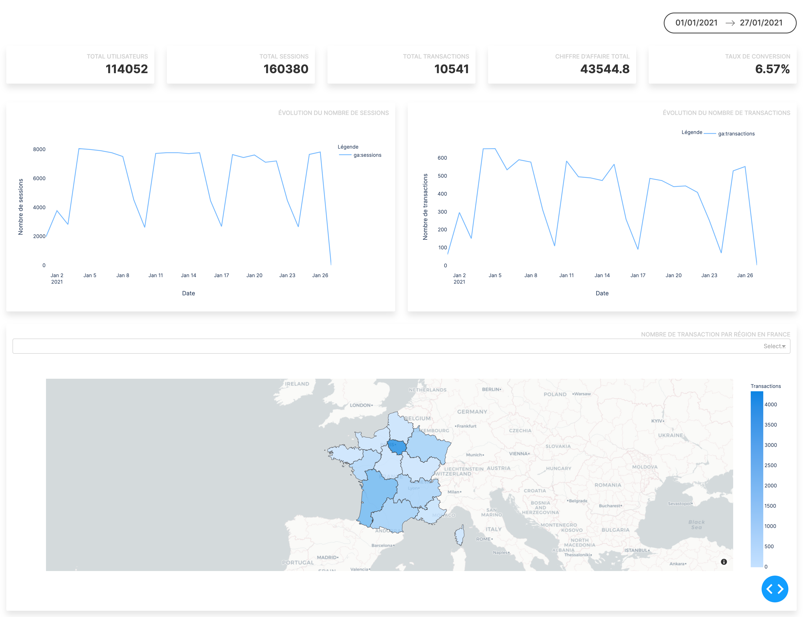

# Python Google Analytics Dashboard

Quick dashboard made with Dash and Python for a school exercise. 

All datas are extracted from a Google Analytics data export.

to run the dashboard :

```shell
python3 main.py
```

And then go on `http://localhost:8050`



